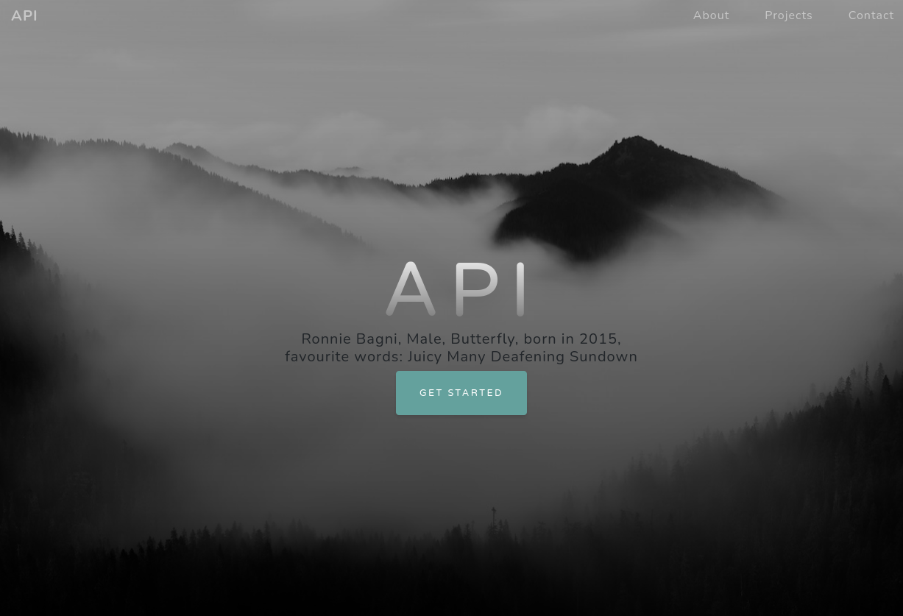
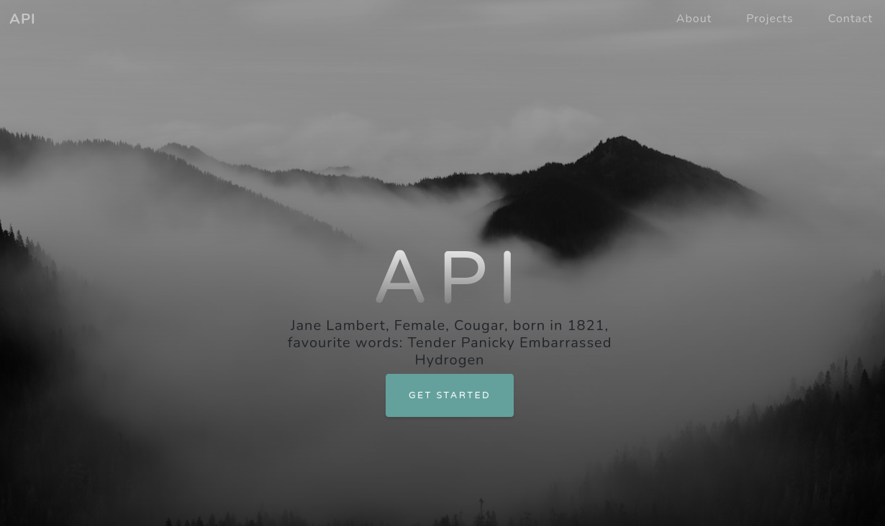

# API - Labo HTTP
Auteurs :
Guilain Mbayo,
Mehdi Salhi

# Etape 1
## Description

## Marche à suivre

Commencer par créer un dossier docker-images. 

Ensuite, créer un dossier "apache_php-image" dans le dossier 
créé précédemment. 

Pour finir, créer un fichier Dockerfile dans ce dossier.

Ecrire le contenu suivant dans le dockerfile:
```
FROM php:7.2-apache
COPY src/ /var/www/html/
```

Cela va permettre de créer un container docker à partir de l'image *php:7.2-apache*
tout en copiant le contenu de notre répertoire *src/* local vers le répertoire
*/var/www/html/* du container docker.

Créer un répertoire src au même niveau que le Dockerfile.

Construire et lancer l'image docker à l'aide des commandes suivantes:
```
sudo docker build -t my-php-app .
sudo docker run -d -p 8080:80 my-php-app 
```
*Noter l'utilisation du `-p` qui va mapper le port 80 de notre serveur apache
au port 8080 de notre service docker.*

Se connecter à un terminal dans le container que l'on vient d'exécuter:

```
sudo docker exec -it my-running-app2 /bin/bash
```
On peut ensuite explorer l'arborescence à l'aide des commandes
classic (ls, cd, etc...)

Créer un fichier "index.html" dans le répertoire src créé précédemment. Ce
fichier servira de page d'accueil pour notre serveur apache.
Dans notre cas, nous avons inclus un bootsrap déjà fait afin d'avoir une
présentation plus élégante qu'un simple titre sur fond blanc.

## Démo
### Construction de l'image
Depuis le répértoire contenant le Dockerfile:
```
sudo docker build -t my-php-app .
```
### Lancement de l'image
```
sudo docker run -d -p 8080:80 my-php-app 
```

### Accès au contenu depuis un navigateur
Se rendre à l'adresse *localhost:8080*. 

# Etape 2
## Prérequis
Installer node.js et npm

## Description

## Marche à suivre
Au même niveau que le répertoire "apache_php-image" créé à l'étape 1,
créer un répertoire express-image.

Ensuite, créer un fichier Dockerfile ainsi qu'un répertoire *src*
dans ce dossier.

Pour choisir l'image de node.js à installer, nous avons chercher sur 
`node.js.org` la dernière version stable de node. En l'occurence, il 
s'agissait de la version 16.13.1.

Nous avons donc utilisé une image de la version 16.13.1-alpine.

Créer un *package.json*dans le répertoir *src"
à l'aide de la commande suivante:
```
npm init
```
*Noter que les informations renseignée peuvent être choisie selon leur 
pertinence pour l'utilisateur, ou laisser par défaut*

Afin de générer des utilisateur de manière aléatoire dans notre *package.json*,
utiliser la commande suivante:
```
npm install --save chance
```

Créer un fichier *index.js*, qui contiendra le script js voulu.

Dans ce fichier, nous avons entré les instructions suivantes:
```
var chance = require('chance');
var chance = new Chance();

for(var i = 0; i < 10; ++i) {
    if(chance.gender() == "Male") {
        console.log("Hello Mr " + chance.animal());
    } else{
        console.log("Hello Mrs " + chance.animal());
    }
}
```
### Express
Aller dans le répertoire src/ puis
```
npm install --save express
```
Modifier le fichier index.js

```
// Importe le module express                                                                              
var express = require('express');                                                                         
var app = new express();                                                                                  
                                                                                                          
// execute le code à chaque requête "GET /"                                                               
app.get('/', function(req, res) {                                                                         
    res.send("You tried to access /.");                                                                   
});                                                                                                       
                                                                                                          
// execute le code à chaque requête "GET /test"                                 
                              
app.get('/test', function(req, res) {                                                                     
    res.send("You tried to access /test.");                                                               
});                                                                                                       
                                                                                                          
// Met l'application en mode écoute sur le port 3000 et execute la fonction                               
// "function() à chaque nouvelle connexion                                                                
app.listen(3000, function() {                                                                             
    console.log("Accepting HTTP request on port 3000");                                                   
});     
```

Puis tester en lancant
```
node index.js
```
Puis executer la commande suivante depuis un terminal, réaliser une requête 
"GET / HTTP/1.1" et  "GET /test HTTP/1.1" et observer le résultat coté serveur.

On constate que ce script permet de réaliser un aiguillage en fonction de la 
requête du client afin de lui renvoyer le contenu désiré.

```
telnet localhost 3000
```

On peut construire l'image docker, la lancer, puis inspecter son 
adresse ip à l'aide des commandes suivantes
```
sudo docker build -t api/express .

sudo docker run -d --name express_dynamic api/express

sudo docker inspect express_dynamic | grep IPAddress
```

On peut ensuite se connecter au container docker à l'aidede telnet et
de l'adresse ip récupérée au point précédent et le port renseigner dans le
fichier "index.js":
```
telnet 172.17.0.2 3000
```

On peut lancer l'image dans un container docker en mappant le port 8080
au port 3000 afin de ne pas avoir à passer par l'adresse ip du container.
Ceci s'effectue avec la commande suivante:
```
sudo docker run -p 8080:3000 api/express
```

Pour obtenir le même comportement que précédemment, il suffit alors d'utiliser
la commande suivante:
```
telnet localhost 8080
```

# Etape 3
## description

## Marche à suivre
Commencer par construire et lancer les deux images créées aux 
étapes 1 et 2 sans les mapper.

Inspecter les deux container afin de récupérer leurs adresses ip respectives.
Comme nous utilisons un système linux, on peut se connecter aux deux containers
directement avec la commande telnet en utilisant les adresses ip respectives
et les ports 80 pour le static et 3000 pour le dynamic.

Créer un dossier nommé "docker-images" et créer un fichier Dockerfile à l'intérieur.
Dans le Dockerfile, écrire:
```
FROM php:7.2-apache
COPY conf/ /etc/apache2

RUN a2enmod proxy proxy_http
RUN a2ensite 000-* 001-*
```

Créer un dossier nommé "conf". Dans ce dossier, créer un dossier nommé
site-available.
Dans ce dernier dossier, créer deux fichier nommés respectivement 
"000-default.conf" et "001-reverse-proxy.conf".

Dans le fichier "001-reverse-proxy.conf", écrire:
```
<VirtualHost *:80>
    ServerName revprox

    ProxyPass "/api/animals/" "http://172.17.0.2:3000/"
    ProxyPassReverse "/api/animals/" "http://172.17.0.2:3000/"


    ProxyPass "/" "http://172.17.0.3:80/"
    ProxyPassReverse "/" "http://172.17.0.3:80/"

</VirtualHost>
```
Dans le fichier "000-default.conf", simplement écrire:

```
<VirtualHost *:80>
</VirtualHost>
```

On peut ensuite construire et lancer notre nouvelle image en mapant le port
8080 au port 80 du container. Cela permet de s'y connecter et d'exécuter des 
requêtes (avec telnet par exemple). On peut constater que les deux fichier
".conf" créés précédemment fonctionne, car le reverse proxy séléctionne bien
soit la configuration par défaut, qui renvoie un message d'erreur, soit 
la configuration "reverse-proxy" qui va nous rediriger sur l'un ou l'autre de
nos container non mappés.

```
Depuis le repertoire contenant le Dockerfile du site statique, construire puis 
lancer l'image
sudo docker build -t api/static_apache .
sudo docker run -d api/static_apache

Depuis le repertoire contenant le Dockerfile du site express.js, construire 
puis lancer l'image
sudo docker build -t api/express .
sudo docker run -d api/express

Récupérer les adresses IP des deux containers lancé précédement:
Obtenir le nom des contrainers lancés
sudo docker ps

Inspecter les deux containers
sudo docker inspect <nom_container_lancé> | grep IPAddress

Puis mettre les adresses IP respective dans le fichier 001-reverse-proxy.conf
pour effectuer les bonnes redirections

Depuis le repertoire contenant le Dockerfile le reverse proxy, construire 
puis lancer l'image
sudo docker build -t api/reverse_proxy_apache .
sudo docker run -d -p 8080:80 api/reverse_proxy_apache
Puis se connecter au serveur:
telnet localhost 8080
Et entrer:
GET / HTTP/1.1
Host: revprox

Puis constater la redirection vers le site bootstrap
Réeffectuer une connexion pour tester la redirection vers le site express.js
telnel localhost 8080
Et entrer:
GET /api/animals/HTTP/1.1
Host: revprox
```
## Démo

# Etape 4

## Marche à suivre

Mettre à jours le fichier Dockerfile des étapes 1 et 2 afin d'installer
vim dans chacune de ces deux images. Pour cela, rajouter cette commande:
```
RUN apt-get update && \
    apt-get install -y vim
```

Note:
Afin de pouvoir nous connecter au reverse proxy sans résoudre de nom DNS,
nous avons édité notre fichier "001-reverse-proxy.conf" en lui renseignant 
"localhost" comme nom d'hôte.

Editer le fichier "index.html" créé au point 1 afin d'y rajouter un script
js juste avant la balise fermante du body, ainsi que la librairie jquery.
```
    <!-- jQuery -->
        <script
            src="https://ajax.googleapis.com/ajax/libs/jquery/3.6.0/jquery.min.js"></script>
            
        <!-- Custom script to load animals-->
        <script src="js/animals.js"></script>
</body>
```

Se rendre dans le dossier "js" se trouvant au même niveau que "index.html"
et y créer un fichier "**animals**.js". Dans ce fichier, écrire le contenu
suivant:
``` 
/*
    API - Labo HTTP Infrastructure
    Authors: Guilain Mbayo, Mehdi Salhi
    Date: 30.12.2021
    Description: JS script that uses jquery to send a query to our node.js
     server and gets a JSON object and then updates the content of our page
      with it every 5 seconds.
 */
$(function() {
    console.log("Loading animals");
    
    function loadAnimals() {
        
            $.getJSON( '/api/animals/', function( animals ) {
                        console.log(animals);
                        var message = animals[0].firstname + " " +
                            animals[0].lastname + ", " +
                            animals[0].gend + ", " +
                            animals[0].specie + ", born in " +
                            animals[0].birthyear + ", favourite words: " +
                            animals[0].favouriteWords;

                    $(".mySuperClass").html(message);
                    });
    };

    loadAnimals();
    setInterval(loadAnimals, 5000);
});
```

La ligne **$(".mySuperClass").html(message);** permet de mettre à jour 
les éléments qui font partie de la classe "**mySuperClass**".

Construire et lancer les containers Docker
```
Depuis les repertoires associés aux containers voulus:
sudo docker build -t api/ajax .
sudo docker build -t api/express .
sudo docker build -t api/rp .

Puis lancer les containers:
sudo docker run -d api/ajax
sudo docker run -d api/express
sudo docker run -d -p 8080:80 api/rp

Puis accéder au reverse proxy depuis un navigateur avec l'adresse 
localhost:8080 et constater la page se mettre à jour toutes les 5 secondes.
```

Résultat: 




