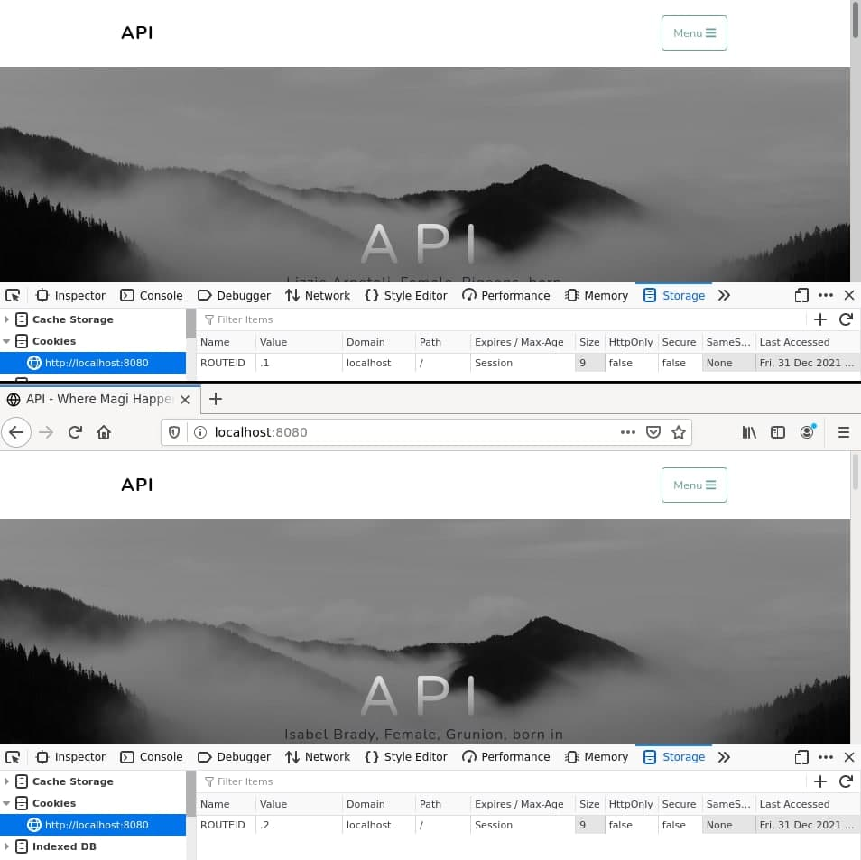
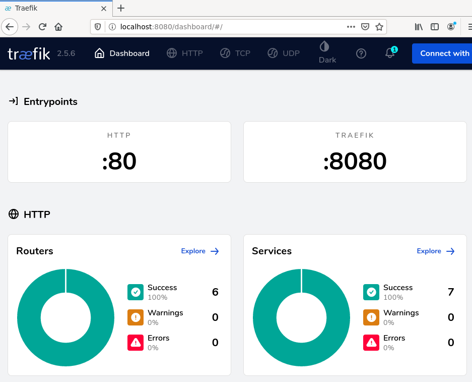
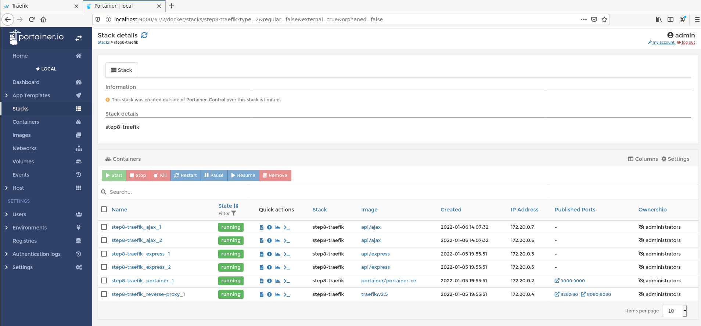

# API - Labo HTTP
Auteurs :
Guilain Mbayo,
Mehdi Salhi

# Etape 1 - Serveur HTTP avec contenu statique
## Description
Implémenter un serveur http dockerisé délivrant du contenu statique.

## Choix d'implémentation
Nous avons implémenté un serveur http Apache2 servant un site à contenu 
statique utilisant un modèle Bootstrap, le tout dans un container docker.

## Marche à suivre

Créer un fichier Dockerfile avec le contenu suivant: 

```
FROM php:7.2-apache
COPY src/ /var/www/html/
```

Cela va permettre de créer un container docker à partir de l'image *php:7.2-apache*
tout en copiant le contenu de notre répertoire *src/* local vers le répertoire
*/var/www/html/* du container docker.

Créer un répertoire src au même niveau que le Dockerfile. Puis construire et 
lancer l'image docker à l'aide des commandes suivantes:
```
sudo docker build -t my-php-app .
sudo docker run -d -p 8080:80 my-php-app 
```
*Noter l'utilisation du `-p` qui va mapper le port 80 de notre serveur apache
au port 8080 de notre service docker. Le serveur dockerisé sera donc 
accessible depuis la machine hôte via l'adresse localhost:8080.

Se connecter à un terminal dans le container que l'on vient d'exécuter:

```
sudo docker exec -it my-running-app2 /bin/bash
```
On peut ensuite explorer l'arborescence à l'aide des commandes
classic (ls, cd, etc...)

Créer un fichier "index.html" dans le répertoire src créé précédemment. Ce
fichier servira de page d'accueil pour notre serveur http apache.
Dans notre cas, nous avons inclus un modèle bootstrap déjà fait afin d'avoir une
présentation plus élégante qu'un simple titre sur fond blanc.

## Démo et procédure pas à pas
### Construction de l'image
Depuis le répértoire contenant le Dockerfile:
```
sudo docker build -t my-php-app .
```
### Lancement de l'image
```
sudo docker run -d -p 8080:80 my-php-app 
```

### Accès au contenu depuis un navigateur
Se rendre à l'adresse *localhost:8080*. 

# Etape 2 - Serveur http dynamique qvec node.js
## Prérequis
Installer node.js et npm

## Description
Implémenter un serveur HTTP avec servant du contenu dynamique et aléatoire 
avec express.js

## Marche à suivre

Créer un fichier Dockerfile ainsi qu'un répertoire *src*
dans ce dossier.

Pour choisir l'image de node.js à installer, nous avons chercher sur 
`node.js.org` la dernière version stable de node. En l'occurence, il 
s'agissait de la version 16.13.1.

Nous avons donc utilisé une image de la version 16.13.1-alpine.

Créer un *package.json*dans le répertoir *src"
à l'aide de la commande suivante:
```
npm init
```
*Noter que les informations renseignées peuvent être choisie selon leur 
pertinence pour l'utilisateur ou être laissées par défaut*

Afin de générer du contenu aléatoire, nous avons installé le module chance 
avec la commande suivante :
```
npm install --save chance
```

Créer un fichier *index.js*, qui contiendra le script js voulu.

Dans ce fichier, nous avons entré les instructions suivantes:
```
var chance = require('chance');
var chance = new Chance();

for(var i = 0; i < 10; ++i) {
    if(chance.gender() == "Male") {
        console.log("Hello Mr " + chance.animal());
    } else{
        console.log("Hello Mrs " + chance.animal());
    }
}
```
### Express
Aller dans le répertoire src/ puis
```
npm install --save express
```
Modifier le fichier index.js

```
// Importe le module express                                                                              
var express = require('express');                                                                         
var app = new express();                                                                                  
                                                                                                          
// execute le code à chaque requête "GET /"                                                               
app.get('/', function(req, res) {                                                                         
    res.send("You tried to access /.");                                                                   
});                                                                                                       
                                                                                                          
// execute le code à chaque requête "GET /test"                                 
                              
app.get('/test', function(req, res) {                                                                     
    res.send("You tried to access /test.");                                                               
});                                                                                                       
                                                                                                          
// Met l'application en mode écoute sur le port 3000 et execute la fonction                               
// "function() à chaque nouvelle connexion                                                                
app.listen(3000, function() {                                                                             
    console.log("Accepting HTTP request on port 3000");                                                   
});     
```

Puis tester en lancant
```
node index.js
```
Puis executer la commande suivante depuis un terminal, réaliser une requête 
"GET / HTTP/1.1" et "GET /test HTTP/1.1" et observer le résultat coté serveur.

On constate que ce script permet de réaliser un aiguillage en fonction de la 
requête du client afin de lui renvoyer le contenu désiré.

```
telnet localhost 3000
```

On peut construire l'image docker, la lancer, puis inspecter son 
adresse ip à l'aide des commandes suivantes
```
sudo docker build -t api/express .

sudo docker run -d --name express_dynamic api/express

sudo docker inspect express_dynamic | grep IPAddress
```

On peut ensuite se connecter au container docker à l'aide de telnet et
de l'adresse ip récupérée au point précédent et le port renseigner dans le
fichier "index.js":
```
telnet 172.17.0.2 3000
```

On peut lancer l'image dans un container docker en mappant le port 8080
au port 3000 afin de ne pas avoir à passer par l'adresse ip du container.
Ceci s'effectue avec la commande suivante:
```
sudo docker run -p 8080:3000 api/express
```

Pour obtenir le même comportement que précédemment, il suffit alors d'utiliser
la commande suivante:
```
telnet localhost 8080
```

# Etape 3 - Reverse proxy avec Apache
## Description
Implémenter un reverse proxy avec apache.

## Marche à suivre
Commencer par construire et lancer les deux images créées aux 
étapes 1 et 2 sans les mapper.

Inspecter les deux container afin de récupérer leurs adresses ip respectives.
Comme nous utilisons un système linux, on peut se connecter aux deux containers
directement avec la commande telnet en utilisant les adresses ip respectives
et les ports 80 pour le static et 3000 pour le dynamic.

Créer un dossier nommé "docker-images" et créer un fichier Dockerfile à l'intérieur.
Dans le Dockerfile, écrire:
```
FROM php:7.2-apache
COPY conf/ /etc/apache2

RUN a2enmod proxy proxy_http
RUN a2ensite 000-* 001-*
```

Créer un dossier nommé "conf". Dans ce dossier, créer un dossier nommé
site-available.
Dans ce dernier dossier, créer deux fichier nommés respectivement 
"000-default.conf" et "001-reverse-proxy.conf".

Dans le fichier "001-reverse-proxy.conf", écrire:
```
<VirtualHost *:80>
    ServerName revprox

    ProxyPass "/api/animals/" "http://172.17.0.2:3000/"
    ProxyPassReverse "/api/animals/" "http://172.17.0.2:3000/"


    ProxyPass "/" "http://172.17.0.3:80/"
    ProxyPassReverse "/" "http://172.17.0.3:80/"

</VirtualHost>
```
Dans le fichier "000-default.conf", simplement écrire:

```
<VirtualHost *:80>
</VirtualHost>
```

On peut ensuite construire et lancer notre nouvelle image en mapant le port
8080 au port 80 du container. Cela permet de s'y connecter et d'exécuter des 
requêtes (avec telnet par exemple). On peut constater que les deux fichier
".conf" créés précédemment fonctionne, car le reverse proxy séléctionne bien
soit la configuration par défaut, qui renvoie un message d'erreur, soit 
la configuration "reverse-proxy" qui va nous rediriger sur l'un ou l'autre de
nos container non mappés.

```
Depuis le repertoire contenant le Dockerfile du site statique, construire puis 
lancer l'image
sudo docker build -t api/static_apache .
sudo docker run -d api/static_apache

Depuis le repertoire contenant le Dockerfile du site express.js, construire 
puis lancer l'image
sudo docker build -t api/express .
sudo docker run -d api/express

Récupérer les adresses IP des deux containers lancé précédement:
Obtenir le nom des contrainers lancés
sudo docker ps

Inspecter les deux containers
sudo docker inspect <nom_container_lancé> | grep IPAddress

Puis mettre les adresses IP respective dans le fichier 001-reverse-proxy.conf
pour effectuer les bonnes redirections

Depuis le repertoire contenant le Dockerfile le reverse proxy, construire 
puis lancer l'image
sudo docker build -t api/reverse_proxy_apache .
sudo docker run -d -p 8080:80 api/reverse_proxy_apache
Puis se connecter au serveur:
telnet localhost 8080
Et entrer:
GET / HTTP/1.1
Host: revprox

Puis constater la redirection vers le site bootstrap
Réeffectuer une connexion pour tester la redirection vers le site express.js
telnel localhost 8080
Et entrer:
GET /api/animals/HTTP/1.1
Host: revprox
```
## Démo

# Etape 4

## Marche à suivre

Mettre à jours le fichier Dockerfile des étapes 1 et 2 afin d'installer
vim dans chacune de ces deux images. Pour cela, rajouter cette commande:
```
RUN apt-get update && \
    apt-get install -y vim
```

Note:
Afin de pouvoir nous connecter au reverse proxy sans résoudre de nom DNS,
nous avons édité notre fichier "001-reverse-proxy.conf" en lui renseignant 
"localhost" comme nom d'hôte.

Editer le fichier "index.html" créé au point 1 afin d'y rajouter un script
js juste avant la balise fermante du body, ainsi que la librairie jquery.
```
    <!-- jQuery -->
        <script
            src="https://ajax.googleapis.com/ajax/libs/jquery/3.6.0/jquery.min.js"></script>
            
        <!-- Custom script to load animals-->
        <script src="js/animals.js"></script>
</body>
```

Se rendre dans le dossier "js" se trouvant au même niveau que "index.html"
et y créer un fichier "**animals**.js". Dans ce fichier, écrire le contenu
suivant:
``` 
/*
    API - Labo HTTP Infrastructure
    Authors: Guilain Mbayo, Mehdi Salhi
    Date: 30.12.2021
    Description: JS script that uses jquery to send a query to our node.js
     server and gets a JSON object and then updates the content of our page
      with it every 5 seconds.
 */
$(function() {
    console.log("Loading animals");
    
    function loadAnimals() {
        
            $.getJSON( '/api/animals/', function( animals ) {
                        console.log(animals);
                        var message = animals[0].firstname + " " +
                            animals[0].lastname + ", " +
                            animals[0].gend + ", " +
                            animals[0].specie + ", born in " +
                            animals[0].birthyear + ", favourite words: " +
                            animals[0].favouriteWords;

                    $(".mySuperClass").html(message);
                    });
    };

    loadAnimals();
    setInterval(loadAnimals, 5000);
});
```

La ligne **$(".mySuperClass").html(message);** permet de mettre à jour 
les éléments qui font partie de la classe "**mySuperClass**".

Construire et lancer les containers Docker
```
Depuis les repertoires associés aux containers voulus:
sudo docker build -t api/ajax .
sudo docker build -t api/express .
sudo docker build -t api/rp .

Puis lancer les containers:
sudo docker run -d api/ajax
sudo docker run -d api/express
sudo docker run -d -p 8080:80 api/rp

Puis accéder au reverse proxy depuis un navigateur avec l'adresse 
localhost:8080 et constater la page se mettre à jour toutes les 5 secondes.
```

Résultat: 


### Sans proxy
Notre démo ne fonctionnerait pas sans un reverse proxy à cause du mécanisme 
de sécurité "same-origin" qui empêche de charger des scripts qui ne 
proviennent pas de la même origine que la page.


# Etape 5

## Marche à suivre
Tout d'abord, nous avons modifié notre fichier Dockerfile du reverse proxy
en y ajoutant ces lignes:
```
COPY apache2-foreground /usr/local/bin/
RUN chmod +x /usr/local/bin/apache2-foreground
```

Ensuite, nous avons créer un fichier "apache2-foreground" au même
niveau que le Dockerfile en y incluant ce code:
```
#!/bin/bash
set -e

# Add setup for API
echo "Setup for API:"
echo "Static: $STATIC_APP"
echo "Dynamic: $DYNAMIC_APP"


# Note: we don't just use "apache2ctl" here because it itself is just a shell-script wrapper around apache2 which provides extra functionality like "apache2ctl start" for launching apache2 in the background.
# (also, when run as "apache2ctl <apache args>", it does not use "exec", which leaves an undesirable resident shell process)

: "${APACHE_CONFDIR:=/etc/apache2}"
: "${APACHE_ENVVARS:=$APACHE_CONFDIR/envvars}"
if test -f "$APACHE_ENVVARS"; then
	. "$APACHE_ENVVARS"
fi

# Apache gets grumpy about PID files pre-existing
: "${APACHE_RUN_DIR:=/var/run/apache2}"
: "${APACHE_PID_FILE:=$APACHE_RUN_DIR/apache2.pid}"
rm -f "$APACHE_PID_FILE"

# create missing directories
# (especially APACHE_RUN_DIR, APACHE_LOCK_DIR, and APACHE_LOG_DIR)
for e in "${!APACHE_@}"; do
	if [[ "$e" == *_DIR ]] && [[ "${!e}" == /* ]]; then
		# handle "/var/lock" being a symlink to "/run/lock", but "/run/lock" not existing beforehand, so "/var/lock/something" fails to mkdir
		#   mkdir: cannot create directory '/var/lock': File exists
		dir="${!e}"
		while [ "$dir" != "$(dirname "$dir")" ]; do
			dir="$(dirname "$dir")"
			if [ -d "$dir" ]; then
				break
			fi
			absDir="$(readlink -f "$dir" 2>/dev/null || :)"
			if [ -n "$absDir" ]; then
				mkdir -p "$absDir"
			fi
		done

		mkdir -p "${!e}"
	fi
done

exec apache2 -DFOREGROUND "$@"
```

Ensuite, nous avons créer un dossier "templates", puis un fichier
"config-template.php" dans ce dossier. Ce fichier contient le code
suivant:
```
<?php
    $dynamic_app = getenv('DYNAMIC_APP');
    $static_app = getenv('STATIC_APP');
?>

<VirtualHost *:80>
    ServerName localhost

    ProxyPass '/api/animals/' 'http://<?php print "$dynamic_app"?>/'
    ProxyPassReverse "/api/animals/" "http://<?php print "$dynamic_app"?>/'


    ProxyPass '/' 'http://<?php print "$static_app"?>/'
    ProxyPassReverse '/ '<?php print "$static_app"?>/'

</VirtualHost>
```

Rajouter cette ligne dans dans le fichier "apache2-foreground":
```
php /var/apache2/templates/config-template.php > /etc/apache2/sites-available/001-reverse-proxy.conf
```

Procédure:
```
sudo docker run -d -e STATIC_APP=172.17.0.2:80 -e DYNAMIC_APP=172.17.0.3:3000 -p
 8080:80 api/dynrp
```

# Etape 6 - Load Balancer

## Marche à suivre
Nous avons décidé de ne pas implémenter les adresses ip dynamique pour
cette étape, car nous lançons plusieurs containers et ne voulons pas devoir
passer 5 ou plus adresses ip en paramètre à chaque fois.

Afin de mettre en place le load balancing, il suffit de définir des 
"proxy balancer" dans le fichier "001-reverse-proxy.conf" afin de 
renseigner les différent serveurs disponible au balancing pour une url.
```
<VirtualHost *:80>
    ServerName localhost

    <Proxy "balancer://dynamic">
        BalancerMember "http://172.17.0.2:3000"
        BalancerMember "http://172.17.0.3:3000"
        ProxySet lbmethod=byrequests
    </Proxy>

    ProxyPass        "/api/animals/" "balancer://dynamic/"
    ProxyPassReverse "/api/animals/" "balancer://dynamic/"

    <Proxy "balancer://static">
        BalancerMember "http://172.17.0.4:80/"
        BalancerMember "http://172.17.0.5:80/"
        ProxySet lbmethod=byrequests
    </Proxy>

    ProxyPass        "/" "balancer://static/"
    ProxyPassReverse "/" "balancer://static/"

</VirtualHost>
```

Les adresses ip sont évidemment à changer en fonction de la configuration
des différents containers.

En lançant tous les serveurs et en vérifiant les logs des deux serveurs
dynamics, on voit qu'ils répondent tous deux à des requêtes.
```
sudo docker logs <nom_container>
```
On peut aussi arrêter l'un des serveurs de chaque groupe et voir 
que le site est toujours affiché et que les requêtes dynamiques 
continue à recevoir des réponses.

## Avec traefik


# Etape 7 - round-robin vs sticky sessions
## Marche à suivre
Tout d'abord, il faut ajouter le module "headers" aux modules chargés dans le
Dockerfile du reverse proxy.
```
RUN a2enmod proxy proxy_http proxy_balancer lbmethod_byrequests headers
```

Ensuite, il faut modifier le fichier "001-reverse-proxy.conf" afin de 
rajouter un header permettant de créer un cookie référençant un des serveurs.
Le cookie est ensuite utilisé pour effectuer toutes les requêtes d'une
session sur le même serveur.
```
<VirtualHost *:80>
    ServerName localhost

    Header add Set-Cookie "ROUTEID=.%{BALANCER_WORKER_ROUTE}e; path=/" env=BALANCER_ROUTE_CHANGED

    <Proxy "balancer://dynamic">
        BalancerMember "http://172.17.0.4:3000"
        BalancerMember "http://172.17.0.3:3000"
    </Proxy>

    ProxyPass        "/api/animals/" "balancer://dynamic"
    ProxyPassReverse "/api/animals/" "balancer://dynamic"

    <Proxy "balancer://static">
        BalancerMember "http://172.17.0.2:80/" route=1
        BalancerMember "http://172.17.0.5:80/" route=2
        ProxySet stickysession=ROUTEID
    </Proxy>

    ProxyPass        "/" "balancer://static/"
    ProxyPassReverse "/" "balancer://static/"


</VirtualHost>
```

Pour tester le bon fonctionnement de la procédure, nous avons vérifié
les cookies dans le navigateur ainsi que regardé les logs de nos containers
afin de savoir quel serveur répondait à quel moment. Nous pouvons confirmer que 
les sticky sessions sont correctement implémentées car en vérifiant les logs 
des serveurs, nous constatons que c'est toujours le même serveur qui réponds aux 
requêtes pour la même session. Du coté client, nous pouvons confirmer que les 
cookies sont correctement créés avec un paramètre ROUTEID comme le montre la 
capture d'écran ci-dessous de deux navigateurs différents qui obtient un 
ROUTEID différent.



# Etape 8 Management UI - Load Balancing, Dynamic cluster management & Management Ui
## Description
Implémenter une solution avec load balancing et gestion dynamique de 
cluster ou les noeuds peuvent apparaître et disparaître et redevenir 
accessibles automatiquement, le tout pouvant être surveillé et géré depuis 
une interface web.

## Implémentation
Nous avons utilisé Docker-Compose, Traefik et Portainer pour implémenter cette 
solution. Docker-compose nous permet de configurer tous nos containers dans 
un fichier et de les lancer. Traefik permet agit comme un 
reverse proxy et gère le load-balancing et 
les sticky session et Portainer permet de gérer les containers depuis une 
interface web. Nous avons mis 2 instances du serveur à contenu statique et 2 
instances du serveur à contenu dynamique, mais cela peut être modifié en tout 
temps dans le fichier docker-compose.

Traefik route dynamiquement et automatiquement les requêtes vers les diverses 
instances du même service. Si une instance est arrêtée, les requêtes sont automatiquement 
redirigées vers une autre instance disponible. Le load balancing est 
également réalisé automatiquement.

## Marche à suivre

Depuis le dossier Step8-Traefik, créer un fichier docker-compose.yml avec le 
contenu suivant :
```
version: '3'
services:
  reverse-proxy:
    # The official v2 Traefik docker image
    image: traefik:v2.5
    # Enables the web UI and tells Traefik to listen to docker
    command: --api.insecure=true --providers.docker
    ports:
      # The HTTP port
      - "${FRONT_HTTP_PORT:-8282}:80"
      # The Web UI (enabled by --api.insecure=true)
      - "8080:8080"
    volumes:
      # So that Traefik can listen to the Docker events
      - /var/run/docker.sock:/var/run/docker.sock

    environment:
      - TRAEFIK_PROVIDERS_DOCKER_EXPOSEDBYDEFAULT=false
      - TRAEFIK_PROVIDERS_DOCKER=true
      - TRAEFIK_ENTRYPOINTS_FRONT=true
      - TRAEFIK_ENTRYPOINTS_FRONT_ADDRESS=:${FRONT_HTTP_PORT:-80}


  # This is our static website with a bootstrap template and making ajax
  # jqueries to our dynamic server
  ajax:
    build: ../Step4-AjaxJQery/docker-images/ajax-query/.
    image: api/ajax
    deploy:
      replicas: 2
    labels:
    # Theses containers will be accessible from localhost:8282/ with stick
    # session enabled
     - "traefik.enable=true"
     - "traefik.http.routers.ajax.rule=PathPrefix(`/`)"
     - "traefik.http.services.ajax.loadbalancer.sticky=true"
     - "traefik.http.services.ajax.loadbalancer.sticky.cookie.name=StickyCookie"


  # This is our dynamic server delivering a JSON table containing random
  # content (names and animals species with birthdates, etc) on port 3000
  # every time a request is made
  express:
    build: ../Step2-Dynamic-HTTP/docker-images/express-image/.
    image: api/express
    deploy:
      replicas: 2
    labels:
    # Theses containers will be accessible from localhost:8282/api/animals/
    # and Traefik will redirect the requests to the port 3000 and replace
    # "/api/animals/" by "/"
      - "traefik.enable=true"
      - "traefik.http.services.express.loadbalancer.server.port=3000"
      - "traefik.http.routers.express.rule=PathPrefix(`/api/animals/`)"
      - "traefik.http.routers.express.middlewares=express-replacepath"
      - "traefik.http.middlewares.express-replacepath.replacepath.path=/"

  portainer:
    # Portainer management UIdocker-images/ajax-query/.
    image: portainer/portainer-ce
    ports:
      - "9000:9000"
    volumes:
      - /var/run/docker.sock:/var/run/docker.sock

```

Puis lancer les containers avec la commande

```
sudo docker-compose --compatibility up -d
```

Cela va construire, configurer et lancer les services suivants :

| Service           | Description            | adresse                     |
|-------------------|------------------------|-----------------------------|
| Traefik           | Monitoring             | localhost:8080              |
| Portainer         | Gestion containers     | localhost:9000              |
| Serveur HTTP      | Contenu HTML statique  | localhost:8282              |
| Serveur HTTP      | Contenu dynamique JSON | localhost:8282/api/animals/ |

Traefik


Portainer
